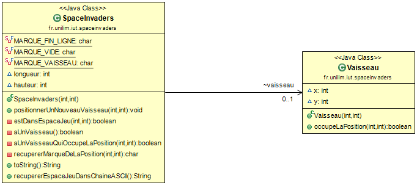
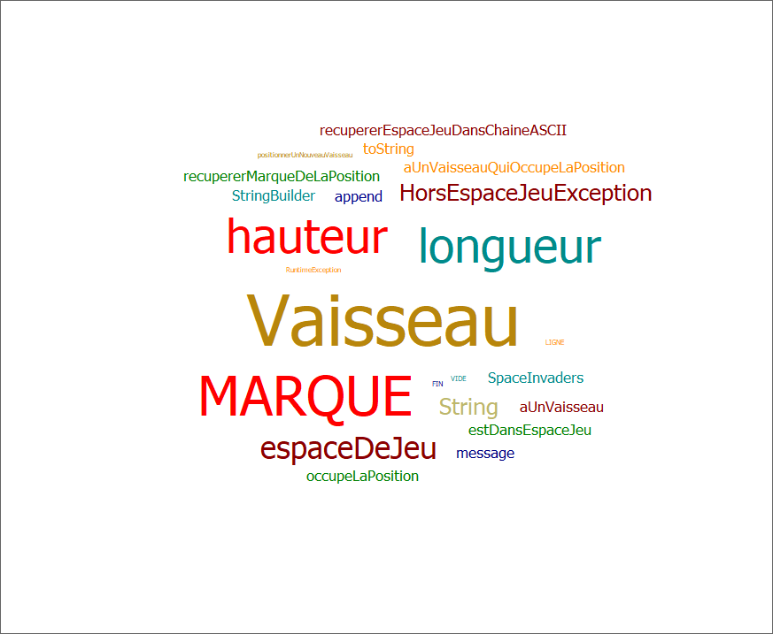
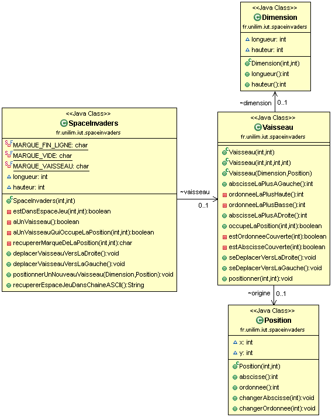
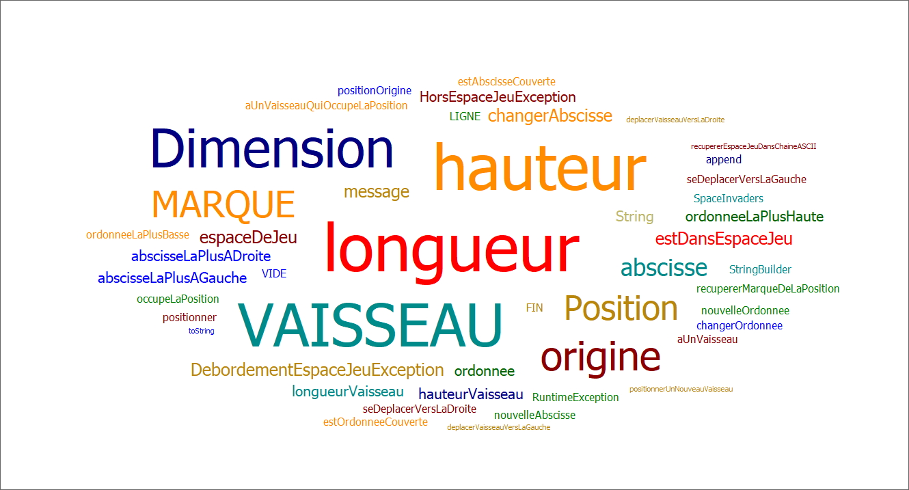

# Space Invaders 

- [Glossaire](#glossaire)
- [Semaine n°1 : du 30 mars au 3 avril](#semaine1)
- [Semaine n°2 : du 6 au 10 avril](#semaine2)

-------------

## Glossaire 

* **Vaisseau** :  véhicule commandé par le joueur, pouvant se déplacer de droite à gauche et ayant la possibilité de lancer des missiles destinés à détruire le(s) envahisseurs.

* **Envahisseur**  :  ennemi qui apparaît à l'écran, se déplace automatiquement et qui doit être détruit par un missile lancé depuis le vaisseau du joueur.

* **Missile** :  projectile envoyé à la verticale par le vaisseau vers l'envahisseur dans le but de le détruire.  
  
------------- 

## Semaine n°1 : du 30 mars au 3 avril 

### Sprints et fonctionnalités réalisées 

#### Fonctionnalité n°1 : Déplacer un vaisseau dans l'espace de jeu (en cours)

- Story n°1 : Créer un espace de jeu  
Un espace de jeu est créé aux dimensions données (2D). 
Cet espace de jeu est vide.
  
    
-  Story n°2 : Positionner un nouveau vaisseau dans l’espace de jeu  
Un nouveau vaisseau est créé.
Le vaisseau est positionné aux coordonnées transmises.
Si un nouveau vaisseau essaye d’être positionné en dehors des limites de l’espace jeu, alors une exception devra être levée.  

Contraintes :  
  - La position souhaitée est transmise par ses coordonnées x et y.
  - Le coin supérieur gauche de l’espace jeu (point en haut à gauche) a pour coordonnées (0,0).
  - La taille du vaisseau est réduite pour l'instant à son minimum (1 seul point).

### Fonctionnalité en cours d’implémentation :
#### Fonctionnalité n°1 : Déplacer un vaisseau dans l'espace de jeu

**L'objectif** de cette première *grosse* fonctionnalité est de pouvoir **déplacer un vaisseau dans l'espace de jeu**.

Pour réaliser cet objectif, d'après notre rapide analyse, nous devons implémenter les *stories* suivantes (considérez pour le moment que les *stories* sont des fonctionnalités de granularité plus fine) :  
- créer un espace de jeu,
- positionner un nouveau vaisseau dans l'espace de jeu,
- déplacer le vaisseau vers la droite dans l'espace de jeu,
- déplacer le vaisseau vers la gauche dans l'espace de jeu.

### Diagramme de classes  

### Nuage de mots du projet spaceinvaders (séance n°1)  

### Difficultés rencontrées 
Aucune

### Remarques diverses
 Pour pouvoir, mettre en place les tests, il a été nécessaire d’ajouter une fonctionnalité supplémentaire qui permet de représenter l’espace de jeu dans une chaîne ASCII.

-------------

## Semaine n°2 : du 6 au 10 avril 

### Sprints et fonctionnalités réalisées 
#### Fonctionnalité n°1 : Déplacer un vaisseau dans l'espace de jeu (terminée)

- Story n°3 : Déplacer le vaisseau vers la droite dans l'espace de jeu  
Le vaisseau se déplace d'un pas vers la droite.
Si le vaisseau se trouve sur la bordure droite de l'espace de jeu, le vaisseau doit rester immobile (aucun déplacement, aucune exception levée : le vaisseau reste juste à sa position actuelle).

- Story n°4 : Déplacer le vaisseau vers la gauche dans l'espace de jeu  
Le vaisseau se déplace d'un pas vers la gauche.
Si le vaisseau se trouve sur la bordure gauche de l'espace de jeu, le vaisseau doit rester immobile (aucun déplacement, aucune exception levée : le vaisseau reste juste à sa position actuelle).

#### Fonctionnalité n°2 : Dimensionner le vaiseau (terminée)

- Etape n°1 : Positionner un nouveau vaisseau avec une dimension donnée  
Un vaisseau est positionné dans l'espace de jeu. Une exception HorsEspaceJeuException est levée dans ce cas.  
On donne une dimension (longueur, hauteur) au vaisseau.
On définit la position exacte du vaisseau.
  
    
- Etape n°2 : Empêcher le débordement du vaisseau dans l'espace de jeu  
On gère le débordement vers le haut et vers la droite. Dans ce cas, une exception DebordementEspaceJeuException est levée.

    
- Etape n°3 : Déplacement vers la droite en tenant compte de la dimension du vaisseau  
Le vaisseau reste immobile s'il est déjà sur la bordure droite de l'espace de jeu.
  
    
- Etape n°4 : Déplacement vers la gauche en tenant compte de la dimension du vaisseau  
Le vaisseau reste immobile s'il est déjà sur la bordure gauche de l'espace de jeu.

### Fonctionnalité en cours d’implémentation :
Aucune.

### Diagramme de classes  

### Nuage de mots du projet spaceinvaders (séance n°2)  

### Difficultés rencontrées 
Aucune.

### Remarques diverses
Aucune.

-------------